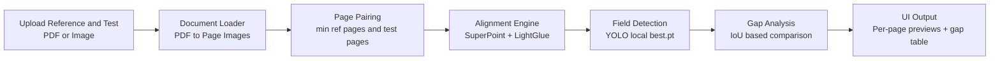

# Multi-Model Document Analysis

A lightweight document comparison tool that aligns reference and test documents, detects handwritten/text regions, and reports missing fields page by page.

## Minimal System Design



## What Is This

This project is a computer vision pipeline for document quality checks. It compares a reference document against a test document and highlights missing text regions after geometric alignment.

## How This Works

1. User uploads a reference and a test document from the Streamlit app.
2. If input is PDF, each page is converted to images.
3. Pages are aligned pairwise to normalize layout shifts.
4. YOLO detects candidate text or handwriting fields on each page.
5. Comparator calculates overlap between reference and test detections.
6. Low-overlap reference detections are marked as missing and displayed.

## Features

- Supports both PDF and image inputs.
- Multi-page processing with per-page alignment preview.
- Per-page field identification preview for reference and aligned test.
- Local model loading from weights/best.pt for predictable deployment.
- Gap analysis summary table with page-level missing items.
- Streamlit UI for interactive review.

## Components

- app.py: Streamlit interface and end-to-end orchestration.
- src/pdf_to_images.py: Converts PDF pages into OpenCV-compatible images.
- src/superglue_aligner.py: Performs feature-based page alignment.
- src/field_identification.py: Loads YOLO and runs field detection.
- src/gap_analysis.py: Computes missing fields using IoU matching.
- weights/best.pt: Primary local detection model used by the app.
- requirements.txt: Python dependencies.

## Project Structure

```text
├── app.py
├── main.py
├── src/
│   ├── field_identification.py
│   ├── gap_analysis.py
│   ├── pdf_to_images.py
│   └── superglue_aligner.py
├── weights/
│   └── best.pt
├── requirements.txt
└── README.md
```

## Setup

### Prerequisites

- Python 3.10 or later
- pip
- Git

### 1) Clone Repository

```bash
git clone <your-repo-url>
cd multi_model_document_analysis
```

### 2) Create and Activate Virtual Environment

Windows PowerShell:

```bash
python -m venv .venv
.venv\Scripts\Activate.ps1
```

macOS/Linux:

```bash
python3 -m venv .venv
source .venv/bin/activate
```

### 3) Install Dependencies

```bash
pip install -r requirements.txt
```

### 4) Verify Local Model File

Make sure this file exists:

```text
weights/best.pt
```

If it is missing, add it before running the app.

## Getting Started

### 1) Start the Streamlit App

```bash
streamlit run app.py
```

### 2) Open the Web UI

Open the Local URL shown in terminal, usually:

```text
http://localhost:8501
```

### 3) Run Your First Comparison

1. Upload a reference document (PDF/JPG/PNG).
2. Upload a test document (PDF/JPG/PNG).
3. Click Run Analysis.
4. Review results in Alignment tab.
5. Review results in Field Identification tab.
6. Review results in Gap Analysis tab.

### 4) Expected Output

- Per-page alignment preview
- Per-page detected field preview
- Combined missing-field table across pages

## Troubleshooting

- If model loading fails, confirm weights/best.pt path and filename.
- If PDF conversion fails, confirm pdf2image dependency installed correctly.
- If Streamlit does not open, run on a custom port:

```bash
streamlit run app.py --server.port 8502
```
